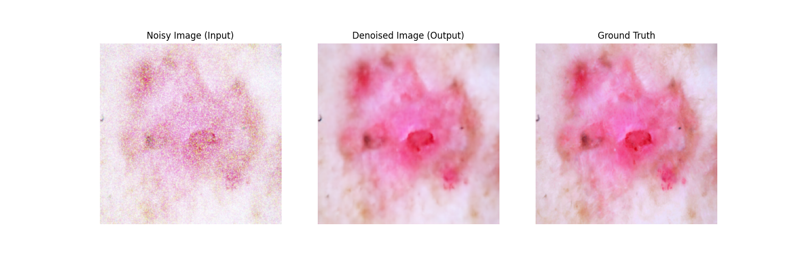

# Medical Image Denoising and Enhancement using GANs

Welcome to the Medical Image Denoising and Enhancement project! This repository contains the implementation of a Generative Adversarial Network (GAN) for denoising and enhancing medical images. The project leverages the power of GANs and pre-trained models to improve the quality of noisy medical images.

## Table of Contents
- [Introduction](#introduction)
- [Dataset](#dataset)
- [Preprocessing](#preprocessing)
- [Model Architecture](#model-architecture)
- [Training](#training)
- [Results](#results)
- [Contributing](#contributing)

## Introduction

Medical images often suffer from noise and artifacts that can hinder accurate diagnosis. This project aims to enhance the quality of medical images using a GAN-based approach. We use a U-Net based generator to denoise and improve the resolution of noisy images, ensuring clearer and more reliable medical images for better diagnosis and research.

## Dataset

We use the ISIC Skin Disease Image Dataset for training and testing our model. The dataset contains labeled images of various skin diseases, providing a rich source of data for training the denoising model.

## Preprocessing

The preprocessing steps involve:
1. **Adding Gaussian Noise:** To simulate noisy medical images, Gaussian noise is added to the original images.
2. **Data Transformation:** Images are resized and normalized to meet the input requirements of the model.

## Model Architecture

Our GAN model uses a U-Net based architecture for the generator. The U-Net consists of:
- **Downsampling Layers:** These layers reduce the spatial dimensions of the input image while increasing the number of feature maps.
- **Bottleneck Layers:** These layers capture the most important features of the image at a reduced resolution.
- **Upsampling Layers:** These layers increase the spatial dimensions back to the original size while combining features from the downsampling path to retain details.

The discriminator network is designed to differentiate between real (original) and fake (denoised) images, helping the generator improve its performance through adversarial training.

## Training

The model is trained using the following steps:
1. **Loading Data:** The noisy and original images are loaded in batches.
2. **Adversarial Training:** The generator creates denoised images from noisy inputs, while the discriminator learns to distinguish between real and fake images.
3. **Loss Calculation:** The loss is calculated based on the difference between the generated and original images, as well as the discriminator's performance.
4. **Optimization:** The model parameters are updated using an optimizer to minimize the loss.

## Results

Here are the results of the denoising process. Each image shows the Noisy Image (Input), Denoised Image (Output), and Ground Truth side by side for various epochs.

### 
Epoch 1150

  

### 
Epoch 1160

  

### 
Epoch 1170

  

### 
Epoch 1180

  

### 
Epoch 1190

  

### 
Epoch 1200

  

## Contributing

We welcome contributions from the community! If you have any suggestions, bug reports, or feature requests, please create an issue or submit a pull request.

